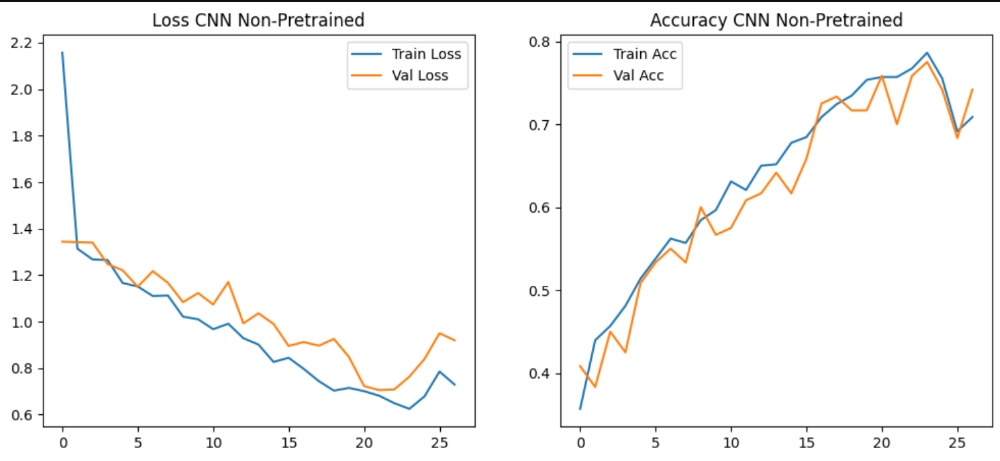
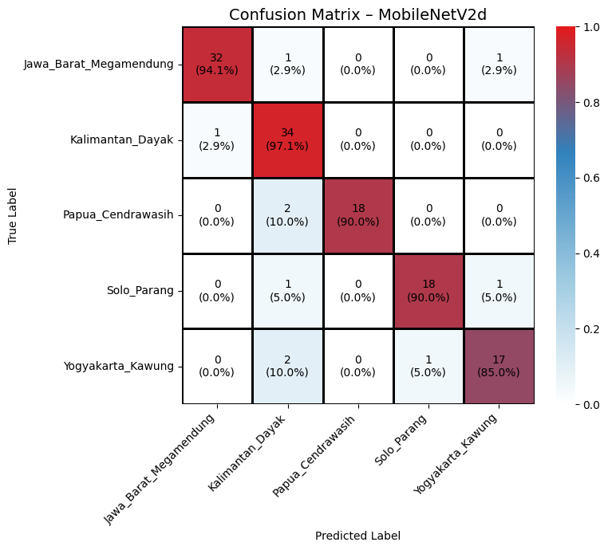

# UAP Machine Learning
## Batik Motif Classification using CNN & Transfer Learning

Repository ini dibuat untuk memenuhi **Ujian Akhir Praktikum (UAP)**  
Mata Kuliah **Pembelajaran Mesin**  
Program Studi **Informatika**

---

## 📌 Deskripsi Proyek
Proyek ini bertujuan untuk membangun sistem **klasifikasi motif batik Indonesia** berbasis citra menggunakan pendekatan **Deep Learning**, yaitu **Convolutional Neural Network (CNN)** dan **Transfer Learning dengan MobileNetV2**.

Model yang telah dilatih kemudian diimplementasikan ke dalam **aplikasi web berbasis Streamlit** sehingga pengguna dapat melakukan prediksi motif batik secara interaktif melalui browser.

---

## 📂 Dataset
Dataset yang digunakan pada proyek ini berasal dari **Hugging Face Dataset Hub**:

- **Nama Dataset**: Batik-Indonesia  
- **Sumber**: https://huggingface.co/datasets/muhammadsalmanalfaridzi/Batik-Indonesia  
- **Jumlah Data**: ±2.600 citra  
- **Jenis Data**: Image  
- **Label**: Motif Batik Indonesia  

Dataset terdiri dari beberapa kelas motif batik daerah di Indonesia dan digunakan untuk proses **training, validasi, serta evaluasi model**.

---

## 🔄 Preprocessing Data
Tahapan preprocessing citra yang dilakukan meliputi:
- Resize gambar menjadi **224 × 224**
- Normalisasi piksel ke rentang **[0 - 1]**
- Data Augmentation (khusus data training):
  - Rotation
  - Zoom
  - Horizontal Flip
  - Brightness Adjustment

---

## 🧠 Model yang Digunakan

### 1️⃣ CNN Non-Pretrained
- CNN dibangun dari awal tanpa pretrained weight
- Digunakan sebagai **baseline model**
- Membutuhkan epoch lebih banyak untuk mencapai performa optimal

### 2️⃣ Transfer Learning – MobileNetV2
- Menggunakan **MobileNetV2 pretrained ImageNet**
- Fine-tuning pada layer akhir
- Memberikan performa yang lebih stabil dan akurasi lebih tinggi

---

## 📊 Evaluasi Model
Evaluasi dilakukan menggunakan:
- Accuracy
- Precision
- Recall
- F1-score
- Confusion Matrix

### 📉 CNN Non-Pretrained
Grafik loss dan accuracy menunjukkan proses pembelajaran yang lebih lambat dan fluktuatif.

### 📈 Transfer Learning – MobileNetV2
Model pretrained menunjukkan konvergensi lebih cepat dan performa yang stabil.

### 🧩 Confusion Matrix
Confusion matrix digunakan untuk menganalisis performa klasifikasi pada tiap kelas batik.

---

## 📋 Tabel Perbandingan Performa Model

| Model | Akurasi | Analisis |
|------|--------|---------|
| CNN Non-Pretrained | ±75% | Training lebih lambat dan kurang stabil |
| MobileNetV2 (Pretrained) | ±90% | Akurasi tinggi, stabil, dan lebih efektif |

---

## 🌐 Aplikasi Web Streamlit
Aplikasi web dikembangkan menggunakan **Streamlit** dengan fitur:
- Upload gambar batik (JPG / PNG)
- Prediksi motif batik secara real-time
- Menampilkan hasil prediksi dan confidence score
- Tampilan UI menggunakan custom CSS

---

## ▶️ Menjalankan Aplikasi Secara Lokal

### 1️⃣ Clone Repository

**git clone https://github.com/sharrziee/UAP-ML-A-KIROUCH-189.git**

---

## 2️⃣ Masuk ke Direktori Project

**cd batik-dashboard**

---

## 3️⃣ Install Dependensi

**pip install streamlit**

Jika tersedia file requirements.txt:

**pip install -r requirements.txt**

---

## 4️⃣ Menjalankan Aplikasi Streamlit

**python -m streamlit run app.py**
